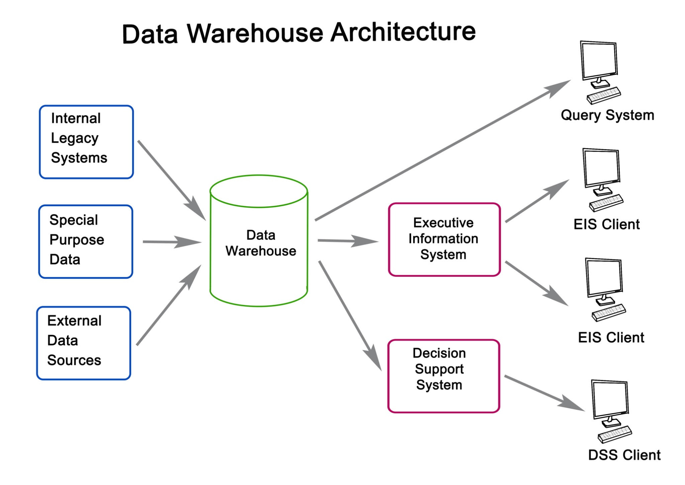

# 📊 AI-Powered Bank Statement Analyzer (RAG)

An advanced Retrieval-Augmented Generation (RAG) pipeline designed to ingest, parse, and analyze complex financial documents (Bank Statements) using Generative AI.



## 🚀 The Problem
Standard RAG pipelines fail with Bank Statements because:
1.  **Table Structure:** Simple text extraction destroys the row/column alignment of transactions.
2.  **Dense Data:** LLMs struggle to associate specific dates with amounts when formatting is lost.
3.  **Hallucinations:** Without structured context, LLMs guess totals rather than calculating them.

## 💡 The Solution
This project implements a **Financial-Grade RAG Pipeline** that solves these issues using:
* **LlamaParse:** To convert PDF tables into **Markdown**, preserving the semantic structure of rows and columns.
* **Vector Search:** Using OpenAI Embeddings to index transactions.
* **Context-Aware Querying:** Retrieving specific transaction blocks to answer queries like "How much did I spend on Uber?" or "Identify suspicious transactions."

## 🛠️ Tech Stack
* **Orchestration:** LlamaIndex
* **Parsing:** LlamaParse (Markdown optimization)
* **LLM:** GPT-4o (Reasoning)
* **Vector Database:** In-Memory / ChromaDB
* **Frontend:** Streamlit

## ⚙️ How to Run
1.  **Clone the repo**
    ```bash
    git clone [https://github.com/surendrallam/financial-rag-analyzer.git](https://github.com/surendrallam/financial-rag-analyzer.git)
    ```
2.  **Install dependencies**
    ```bash
    pip install -r requirements.txt
    ```
3.  **Setup Keys**
    Create a `.env` file and add your `OPENAI_API_KEY` and `LLAMA_CLOUD_API_KEY`.
4.  **Run the App**
    ```bash
    streamlit run app.py
    ```

## 📈 Future Improvements
* **Agentic Layer:** Add a Pandas Query Engine to perform exact mathematical aggregations (Sum/Avg) rather than relying on LLM arithmetic.
* **Privacy:** Integrate local LLMs (Llama 3 via Ollama) for privacy-preserving local analysis.